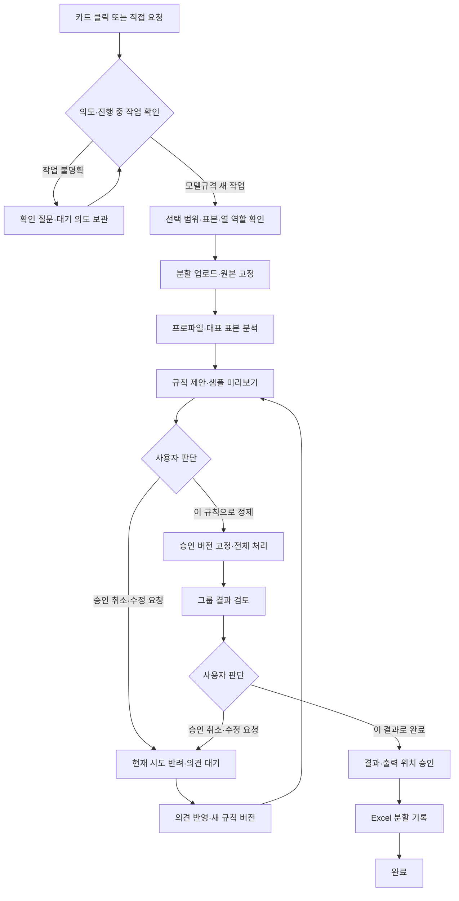

# 모델규격 정제·그룹화 구현 계획

- 상태: 채팅·범위 표본 확인 프로토타입 구현, 공통 요청 흐름 확장 중
- 기준일: 2026-09-15 (실제 소스 확인 + 사용자 대화 기준)
- 대상: KCS_HARNESS / FastAPI / LangGraph / Excel 추가 기능
- 개발 환경: 외부 로컬 Codex 어댑터, 내부 Linux·Python 3.12·Gemma
- 목표 환경: Windows Excel 2108 이상. 실제 API 호환성과 성능은 해당 빌드에서 확인한다.
- 이 문서는 다른 대화에서 이어갈 수 있는 인수인계 문서이자 구현 계획이다. 0장의 현재 상태와 이후의 목표 설계를 구분한다. 소스 존재, 테스트용 응답 검증, 실제 환경 검증을 서로 대체하지 않는다.


## 0. 다음 대화에서 먼저 읽을 인수인계

### 0.1 작업 위치와 개발 원칙

- 실제 프로젝트: `/Users/bae/Desktop/workspace/vibe_coding/KCS_HARNESS`.
- 이 문서: 프로젝트 루트의 `MODEL_NORMALIZATION_PLAN.md`. 사용자가 소문자로 언급해도 별도 중복 파일을 만들지 않는다.
- `.codex/.chatgpt-projects/...`는 대화 작업공간이며 실제 하네스 프로젝트가 아니다. 그곳에 앱을 다시 만들지 않는다. `sources/`는 읽기 전용이다.
- 기본 작업 방식: 사용자가 코드를 반영하고 assistant는 실제 파일을 읽어 정확한 수정 위치와 코드를 안내·리뷰한다. 사용자가 직접 수정을 요청한 경우에만 그 범위를 수정한다. 이전 화면 수정과 이번 문서 업데이트는 명시적으로 요청받았다.
- 설명은 한국어. 사용자는 JS에 익숙하지 않으므로 함수명과 교체 범위를 구체적으로 안내한다.
- 모든 시스템 프롬프트는 `src/prompts/*.yml`에 둔다. 에이전트 클래스나 runtime에 긴 프롬프트 문자열을 다시 넣지 않는다.
- 기존 공통 `AgentNode`는 유지한다. 제거 대상은 과거 코드 탐색 도구 테스트용 그래프 구성이다.
- 승인 횟수 제한 없음. 자동 도구 반복 한도와 사용자 재검토 횟수를 혼동하지 않는다.

### 0.2 환경과 저장 정책: 현재 합의

| 항목 | 현재 상태/결정 |
|---|---|
| 외부 개발 | macOS, Python 3.12, FastAPI, Codex CLI 어댑터 |
| 내부 실행 | Linux 서버, Python 3.12 예상, 내부 OpenAI 호환 LLM 엔드포인트, Nexus 패키지 관리 |
| Excel 목표 | 내부 Windows Excel 2108 및 Excel 2021 이상. 현재 Mac에서 일부 기능을 확인했으며 내부 실기 호환성·대량 성능은 미검증 |
| 모델 전환 | 단일 `src/config.yml`의 `environments.external/internal`을 `KCS_ENV`로 선택 |
| 현재 외부 모델 설정 | `codex_cli`, 모델명 `gpt-5.6-terra` (2026-09-15 파일 기준; 고정된 제품 요구사항 아님) |
| 현재 내부 모델 설정 | `openai_compatible`, `gemma-4-26B-A4B-it-UD-Q4_K_XL.gguf` |
| 채팅 저장 | 인메모리 유지에 사용자 동의. 현재 내부·외부 모두 `storage.provider: memory` |
| PostgreSQL | 연결·저장소 코드 존재. 실제 DB 검증은 하지 않았고, 대화내역 영구 저장의 사용 여부는 보류 |
| SQLite / Redis | 현재 사용하지 않는다. 외부 PostgreSQL 부재를 해결하기 위해 메모리를 사용하기로 함 |
| 복구 | 서버가 살아 있는 동안 일반 채팅 이력 조회 가능. 프로세스 재시작·reload 시 메모리 대화와 작업 소실 |
| 운영 저장 정책 | 대화 영구 저장과 규칙·승인·결과 보관 정책을 각각 결정해야 함. DB 사용을 다음 구현의 선행 조건으로 강제하지 않음 |

프로젝트 루트의 외부 실행 예:

```bash
KCS_ENV=external .venv/bin/python -m uvicorn main:app --app-dir src --port 8000 --reload
```

명령 앞의 `KCS_ENV=external`은 해당 프로세스와 자식 프로세스에만 적용된다. `export KCS_ENV=external`은 현재 셸에서 이후 실행하는 프로세스에도 적용된다. 환경 미지정은 설정 오류이며 외부 모델로 조용히 기본 전환하지 않는다. 내부 DB 접속 정보는 사용 결정 후 `KCS_DATABASE_URL`에 설정하며 이 문서에는 실제 주소·비밀번호를 기록하지 않는다.

Mac 등록 XML: `~/Library/Containers/com.microsoft.Excel/Data/Documents/wef/customs-assistant-prototype.xml`. 프로젝트의 `src/manifest.xml`과 별도 사본이다. 두 파일의 `ReadWriteDocument` 권한을 현재 확인했다. XML 변경은 등록 사본에도 반영하고 Excel을 완전히 종료 후 다시 실행한다. 현재 화면 주소는 `http://localhost:8000/static/excel/taskpane.html`; 내부 서버 배포 주소·인증서 정책과 별도로 검증해야 한다.

### 0.3 실제 구현 상태

| 기능 | 상태 | 근거와 한계 |
|---|---|---|
| FastAPI 정적 add-in 서빙 | 구현·사용 확인 | `src/static/excel`, 등록 XML |
| Codex CLI / 내부 LLM 설정 분리 | 구현 | `settings.py`, `config.yml`, `runtime.py`; 외부 Codex 연결 사용자 확인 |
| 일반 대화 생성·조회·전송 | 구현·사용 확인 | `/conversations`, `/conversations/{id}`, `/chat`; 최근 최대 10턴을 모델 문맥으로 사용 |
| 메모리 대화 잠금·요청 ID 재사용 | 구현 | 기본 대화/턴 수 각각 100 제한. UI 액션 재반환 누락은 아래 잔여 문제 |
| PostgreSQL 대화 저장소 | 코드 있음·사용 보류 | 실제 접속·재시작 보존 미검증. `ui_action` 저장 미반영. 모델 호출 동안 트랜잭션/행 잠금을 유지하는 초기 구현 |
| 범위와 열 확인 | 구현·사용 확인 | 연속된 세 열, 머리글 필수, 최대 데이터 40만 행 크기 허용. 실제 내용은 앞부분 최대 20행만 읽음 |
| 표본 확인 작업 API | 구현 | `POST /normalization/jobs`, `GET /normalization/jobs/{id}`, `POST /normalization/jobs/{id}/analyze` |
| 작업 상태 | 초기 구현 | `CREATED → ANALYZING → REVIEW_READY`, 오류 `FAILED`; 규칙 승인/실행 상태가 아님 |
| 작업 저장 | 메모리 dict | `app.state.normalization_jobs`; 대화 ID·소유자·시도 버전 연결 없음 |
| 첫 화면 → 채팅 전환 | 구현·테스트용 응답 검증 | 카드 즉시 전송, 첫 화면 숨김, + 새 대화로 복귀 |
| 대화 속 범위 카드 | 구현·테스트용 응답 검증 | 입력창 `＋ 범위 첨부`, 열 매핑, 펼치는 표본, 결과 채팅 표시. 현재 표시 표본도 최대 20행 |
| 요청 의도 분류 + ui_action | 부분 구현·결함 확인 | 분류 그래프와 스키마 존재하나 아래 계약 불일치 및 문맥 처리 미완료 |
| 직접 요청 → 자동 범위 읽기 | 미구현 | 현재 모델규격 액션은 `normalizationUI.open()`만 호출. 실제 읽기는 클릭 핸들러에 있음 |
| 거래처·수식의 범위 확인 | 미구현 | 작업 종류 분류 정의만 있고 UI는 다음 단계 연결 안내만 출력 |
| 승인·피드백·새 버전 | 미구현 | RulePlan, attempt, 결정 API, 상태 전환 모두 계획 단계 |
| 전체 데이터 처리·그룹화·출력 | 미구현 | 40만 행 업로드/성능 검증/셀 쓰기를 완료한 것으로 표현하지 않는다 |

이전 화면 수정에서는 가짜 Excel 표본과 모델 응답으로 카드 전송→범위 확인→분석 결과→후속 채팅→새 대화 복귀를 브라우저에서 확인했고 JS 문법과 diff 검사를 통과했다. 이후 요청 분류 변경 전체가 검증됐다는 뜻은 아니다. 실제 사용자도 Mac 범위 읽기와 채팅을 확인했으나 Windows 2108 전체 흐름은 별도 테스트가 필요하다.

### 0.4 최신 사용자 요청과 관찰된 미완료 동작

카드 세 개는 예시 진입점이다. 사용자가 범위를 드래그하고 바로 “모델규격 정제해줘”, “거래처 정리해줘”, “합계 수식 만들어줘”라고 입력해도 같은 작업 흐름에 들어가야 한다.

사용자가 최근 관찰한 대화:

> 사용자: 선택영역 정제해줘
> 도우미: 모델규격 정제, 거래처명 정제, 수식 제안 중 어떤 작업인가요?
> 사용자: 모델규격 정제말이야
> 도우미: 공백·특수문자 등 기준과 원본 예시 3~5개를 보내주세요.

목표는 마지막 응답 대신 현재 선택 범위를 확인하는 카드로 이어지는 것이다. 원본 예시를 채팅에 다시 붙여넣도록 요구하지 않는다. 현재 사용자는 이 문제를 초기 단계의 미완료로 받아들였고, 이번 요청은 계획서 업데이트뿐이다. 실제 분류 결과·실행 로그 없이 이를 프롬프트 문제로만 단정하지 않는다.

### 0.5 코드 대조에서 확인한 잔여 문제 (이번 문서 작업에서는 수정하지 않음)

다음 작업 시작 시 파일을 재확인한다. 사용자가 병행 수정할 수 있으므로 아래 내용은 기준일 스냅샷이다.

1. `agents/request_router.py`: 그래프 입력 키가 `"message"`이다. `AgentState`/`AgentNode`는 `"messages"`를 사용하므로 수정 필요.
2. 같은 파일의 응답 검증이 `if not (isinstance(last, AIMessage) or last.tool_calls or not isinstance(last.content, str))`이다. 의도한 조건은 `not isinstance(...) or last.tool_calls or not isinstance(...)`이며 현재는 잘못된 응답을 허용하거나 속성 접근 오류가 날 수 있다.
3. `api/schemas.py`: `UIAction` 필드가 `text`이나 API 생성부와 JS는 `type`을 사용한다. `type: Literal["confirm_selection"]`로 계약 통일 필요.
4. `api/api.py`: 중복 request_id 반환에서 `ui_action=turn.ui_action`이 누락됐다. 일반 답변 저장/반환은 `None`, 작업 분류 응답은 `action`을 쓰는 현재 수정은 확인했다. `turn`은 중복 요청 반환 블록에서만 참조한다.
5. `runtime.py`: 테스트용 graph는 반환/호출에서 제거됐지만 `get_local_tools` import와 실제 `tools = get_local_tools(...)` 호출이 남아 있다. 세 그래프 모두 `tools=[]`이므로 이 불필요한 초기화를 정리할 대상이다.
6. `prompts/loader.py`: 경로는 필수 인자로 바뀌었지만 오류 메시지에 `agent.yml`이 남아 있다. 실제 `prompt_path.name`을 표시하도록 정리 가능.
7. `ChatRequest.message`는 서버 최대 길이 제한이 없다. UI의 8,000자 제한과 서버 검증을 맞출 필요가 있다.
8. 채팅 이력 조회는 role/content만 반환한다. UI 액션·작업 카드·분석 결과의 재열기 복원은 구현되지 않았다. 일반 채팅 DOM에 결과가 보이는 것과 모델 문맥/서버 이력 연결은 다르다.
9. `/chat`에 active_job_id/job_id와 검토 중 버전이 없고, 정제 Job에도 conversation_id가 없다. 후속 의견을 기존 작업에 반영하는 기준이 아직 없다.

과거 수정 확인: API 경로 `nomalization` 오타는 `normalization`으로 수정됨. 동일 작업 생성 시 `return public_job(existing)`도 현재 있음. `GraphRecursionError`는 개발 도구 graph의 반복에서 발생했고, 현재 일반 채팅은 도구 없는 `chat_graph`로 분리됐다. 한도를 올리는 것으로 대신 해결하지 않는다.

## 1. 목표와 합의 사항

사용자가 선택한 **거래품명·신고품명·모델규격** 세 열을 분석하여 모델 표기를 정제하고, 같은 모델로 판단되는 행을 묶는다. 최대 약 40만 행을 고려한다.

핵심 합의:

1. LLM은 패턴 분석, 규칙 제안, 사용자 의견 해석, 근거 설명을 담당한다.
2. Python 서비스는 승인된 규칙으로 대량 정제·그룹화를 실행한다.
3. 사용자가 만족할 때까지 규칙·결과를 반복해서 검토한다. 승인·재승인 횟수에는 고정 제한을 두지 않는다.
4. **승인 취소·수정 요청**은 현재 제안/검토 시도를 반려 상태로 마무리하고, 사용자 의견을 기다리는 동작이다. 전체 작업을 삭제하거나 종료하는 동작이 아니다.
5. 새 의견을 받으면 변경점을 설명한 새 규칙 버전을 제안한다. 의견만으로 전체 재처리를 자동 시작하지 않는다.
6. 최종 산출물은 “어떤 품명과 모델규격이 무엇을 근거로 하나로 묶였는지” 확인할 수 있는 Excel 시트다.
7. 현재는 대화와 작업을 서버 메모리에서 관리한다. 대화 영구 저장은 사용 여부 보류다. 규칙·승인·결과의 버전 관리는 필요하지만 영구 보관 방식과 재시작 복구는 별도 결정 후 구현한다. 창 재열기 복원과 서버 재시작 복원을 구분한다.
8. 기본 구현은 사용자가 진행한다. 이 계획을 이유로 코드를 자동 수정하지 않으며, 명시적인 직접 수정 요청만 해당 범위에 반영한다.
9. 카드 클릭과 직접 자연어 입력은 공통 요청 판단/작업 흐름으로 연결한다. 세 작업의 승인 절차는 공유하되, 열 구성·규칙·실행 도구는 작업별로 다르게 둔다.

### 1.1 하네스 구조에 대한 합의 (2026-09-15 추가)

목표는 Excel 오른쪽의 add-in에서 해외거래처부호·모델규격 등 정제 업무를 확인·제안·승인·수행까지 지원하는 하네스다. 현재 모듈 분리는 출발점으로 적절하므로 전면 재작성하지 않는다. 채팅/모델 호출 중심의 프로토타입을 **작업 상태와 업무 실행 서비스 중심**으로 확장한다.

- Excel 읽기·쓰기와 사용자 조작은 add-in, 대량 처리와 승인 검증은 서버, 의도 해석·탐색·제안·설명은 LLM이 담당한다.
- 공통 작업 절차는 공유하되 각 업무의 열 구성·분석·검증·실행 서비스를 분리한다. 업무마다 독립 에이전트를 무조건 추가하거나 모든 업무를 한 정제 함수로 합치지 않는다.
- `main.py`, `runtime.py`, `settings.py`, `api/`, `models/`, `prompts/`, `repositories/`, `static/excel/`의 기존 역할은 유지한다.
- 우선순위는 대화↔작업 연결, API의 업무 처리 분리, Excel 접근과 화면 코드 분리다. 새 폴더와 빈 추상 클래스를 한꺼번에 만드는 것을 목표로 삼지 않는다.
- 아래 구조 개선은 **합의된 목표이며 구현 완료가 아니다**. 이전 인수인계의 소스 상태와 검증 범위는 그대로 유효하다.

## 2. 정제와 그룹화의 구분

| 개념 | 출력 | 원칙 |
|---|---|---|
| 표기 정제 | normalized_spec | 공백·문자·단위 등 승인된 변환만 수행 |
| 동등 모델 그룹화 | group_id | 두 품명과 규격 정보를 함께 고려 |
| 대표 표기 선정 | canonical_spec | 원본에 근거한 대표값 또는 승인된 표준 표기 |
| 판정 근거 | rule_ids, reason_codes | 실제 실행한 규칙과 검증 결과 기록 |
| 불확실성 | review_status | 검토 필요·정보 부족을 명시 |

하이픈, 슬래시, 숫자, 선행 0, 전압, 크기, 재질, 옵션 코드를 일괄 삭제하지 않는다. 같은 문자열로 정제됐다는 사실만으로 동일 모델을 확정하지 않는다. 빈 모델규격끼리는 동등 모델로 묶지 않는다.

초기 그룹ID는 데이터셋·결과 버전 안에서의 식별자다. 서로 다른 업로드까지 연결하는 전사 모델 사전은 후속 범위다. 버전 사이에는 별도의 그룹 계보를 기록한다.

## 3. 사용자 흐름과 승인 의미



### 공통 요청과 확인 순서 (추가 합의)

사용자에게 보이는 흐름은 요청 → 데이터 확인 요청 → 표본/열 역할 확인 → 모델 탐색 → 정제 방향 또는 수식 제안 → 승인 → 수행이다. 내부 작업 ID는 모델 탐색 전에 발급해 분석 중 상태와 실패도 조회할 수 있게 한다. 현재 프로토타입은 열 확인 후 job 생성이며 앞으로 입력 수집부터 작업 상태로 확장한다.

- 새 작업인지, 모호한 요청에 대한 답인지, 현재 작업의 수정 의견인지, 일반 질문인지 구분한다.
- “선택영역 정제해줘” 다음 “모델규격 정제말이야”는 보류된 요청의 명확화다. 독립적인 개념 질문으로 잃어버리지 않도록 pending intent를 관리한다.
- “전압은 구분해줘”는 active job의 새 제안 버전을 만드는 의견이다. 새 작업을 자동 생성하지 않는다.
- 범위 확인은 규칙 실행 승인이 아니다. 사용자가 범위를 확인하기 전에는 모델에 표본을 보내 탐색하지 않는 것을 기본으로 한다.
- 승인/반려는 대상 job·attempt·규칙/결과 버전과 결합한다. 일반 문장 “좋아”를 버전 확인 없이 실행 승인으로 처리하지 않는다.

### 버튼 계약

| 버튼 | 의미 | 후속 상태 |
|---|---|---|
| 이 규칙으로 정제 | 데이터·규칙 버전에 대한 실행 승인 | QUEUED |
| 승인 취소·수정 요청 | 현재 시도를 반려하고 의견 대기 | WAITING_FEEDBACK |
| 수정 의견 보내기 | 새 의견을 저장하고 다음 제안 생성 | PLANNING |
| 처리 중단·기준 변경 | 중단 요청 후 청크 경계에서 실행 정지 | CANCEL_REQUESTED → WAITING_FEEDBACK |
| 이 결과로 완료 | 결과 버전과 출력 위치 승인 | EXPORT_READY |
| 작업 종료 | 정제 작업 전체를 종료하고 이력 보존 | CANCELLED |

출력 완료 뒤 수정 요청은 기존 출력 시트를 소급 수정하지 않는다. 같은 작업에서 새 시도를 만들고 별도 결과 버전을 출력한다. “승인 취소”는 이미 수행된 Excel 쓰기를 되돌리는 기능이 아니다.

사용자의 반복 검토 횟수와 LLM 자동 재시도 횟수는 별개다. 자동 재시도·도구 반복에는 자원 제한을 두되, 정상적인 사용자 재검토를 2회·5회 등으로 제한하지 않는다.

## 4. 화면 설계

추가 기능은 하나의 채팅 타임라인 안에 작업 카드를 표시한다. 초기 소개·세 추천 카드는 첫 요청 시 숨기고, 카드 클릭은 텍스트를 입력창에 채우는 데서 끝나지 않고 즉시 전송한다. 새 대화는 첫 화면으로 복귀한다.

상단에 모델규격 정제 패널을 상시 표시하는 설계는 폐기했다. 범위 선택은 도우미 메시지 옆의 작업 카드와 입력창 `＋ 범위 첨부`로 접근한다. 열 역할과 표본은 확인 카드에 표시하고 확인 완료 시 접는다. 결과는 도우미 메시지로 이어 붙인다. 버튼 HTML은 LLM이 생성하지 않고 서버의 구조화된 ui_action/작업 상태에 따라 앱이 만든다.

목표는 직접 요청 후 현재 선택을 자동으로 읽어 확인 카드를 표시하는 것이다. 범위가 없거나 유효하지 않으면 선택을 안내한다. 현재 구현은 모델규격 화면 열기와 수동 읽기까지만 연결돼 있다.

| 작업 종류 | 필요한 입력 확인 |
|---|---|
| model_normalization | 거래품명·신고품명·모델규격 세 역할 |
| counterparty_cleanup | 거래처명과 사용자가 지정한 보조 열; 세 열 강제 금지 |
| formula | 참조 데이터, 원하는 계산, 결과 위치; 임의 수식 자동 실행 금지 |


| 단계 | 화면 요소 |
|---|---|
| 작업 시작 | 세 예시 카드 또는 직접 요청, 진행 중 작업 연결 (작업 목록은 후속) |
| 범위 지정 | 현재 선택 가져오기, 시트·행 수, 헤더 유무, 세 열 매핑 |
| 분석 중 | 업로드·분석 진행률, 오류·취소 |
| 규칙 검토 | 규칙별 설명·예외·변경 전후, 이전 버전 대비 변경점 |
| 승인 취소 후 | 현재 시도 반려 표시, “어떤 기준을 바꿀까요?” 입력 카드 |
| 전체 정제 | 현재 단계, 처리 행 수, 마지막 갱신 시각, 중단 버튼 |
| 결과 검토 | 그룹 수·변경 행 수·검토 필요 수, 대표 그룹, 상세 검토 열기 |
| 결과 확정 | 새 시트/옆 열 선택, 출력 열, 미해결 그룹 처리 방식, 최종 승인 |
| 완료 | 생성된 시트명, 결과 버전, 행 수, 다시 검토하기 |

규칙 승인 버튼은 해당 규칙 버전에 묶인다. 과거 채팅 카드의 승인 버튼은 읽기 전용으로 표시한다.

상세 검토는 하네스의 넓은 웹페이지로 제공한다. 페이지 단위 조회·검색·정렬·필터를 사용한다. Chrome에서 검토해도 같은 작업에 저장된다. Excel에 실제 기록하는 주체는 추가 기능이다.

검토 우선순위는 중요한 규격 충돌 → 큰 그룹 → 애매한 그룹 → 일반 그룹으로 한다. 모든 행을 사용자가 직접 검토했다고 가정하지 않는다. 미해결 항목은 원본 유지·미분류 등 명시한 정책에 따라 출력한다.

## 5. 도구 목록: 무엇을 만들어야 하는가

### 5.1 LLM에 등록할 도구

LLM은 데이터셋 원본 경로나 사용자 신원을 직접 지정하지 않는다. 서버가 현재 작업 컨텍스트를 주입하고 접근 범위를 검증한다. 반환값은 제한된 크기의 요약과 사례다.

| 도구 | 입력 | 출력 | 구현 우선순위 |
|---|---|---|---|
| get_normalization_context | 현재 작업 컨텍스트 | 합의 규칙, 최근 피드백, 검토 버전 요약 | P0 |
| get_dataset_summary | 현재 작업 컨텍스트 | 행 수, 고유 조합 수, 빈값·패턴 통계 | P0 |
| sample_model_patterns | 패턴/품목 조건, limit | 대표 사례, 빈도, 사례 row_id | P0 |
| preview_rule_plan | 구조화 규칙 초안, sample_id | 변경 전후, 충돌·미적용·오류, preview_id | P0 |
| get_group_examples | result_version, group_id, limit | 원본 세 열 사례, 규칙, 충돌, 빈도 | P1 |
| compare_rule_versions | 이전/신규 버전 | 규칙 차이와 영향 요약 | P1 |
| find_counterexamples | 규칙/그룹 조건, limit | 제안에 반하는 사례 | P1 |

LLM의 최종 규칙 제안은 RulePlan 스키마로 검증한 뒤 서버가 새 버전으로 저장한다. 자유 텍스트 설명만 저장해 실행하지 않는다.

**LLM에 노출하지 않을 것:** 사용자 승인 기록, 승인 우회 실행, Excel 쓰기, 사용자 식별자 변경, 파일 경로 임의 접근. 현재 코드 탐색 도구들은 정제 그래프에 기본 제공하지 않는다.

### 5.2 Excel 클라이언트 기능

| 함수 | 입력 | 출력·효과 |
|---|---|---|
| inspectSelection | 현재 Excel 선택 | 시트 식별자, 범위, 헤더 후보, 열 수 |
| captureDatasetChunks | 승인된 열 매핑·범위 | 세 열 텍스트·원본 행 위치를 분할 수집 |
| verifySourceSnapshot | 업로드 시점 메타데이터 | 원본 범위·내용 변경 여부 |
| writeResultChunks | 승인된 export_id와 출력 대상 | 청크별 Excel 기록·확인 응답 |
| restoreActiveJob | 로그인 사용자·작업 선택 | 서버에서 작업·대화 재조회 |

처음에는 하나의 연속된 표 범위를 지원한다. 비연속 선택은 후속으로 둔다. 초기 기본은 필터로 숨겨진 행도 포함하고, 선택 화면에서 이를 명시한다. 보이는 행만 처리는 별도 범위 기능으로 검증 후 추가한다.

### 5.3 서버가 통제할 서비스

| 기능 | 책임 |
|---|---|
| create_job | 소유자·대화·원본 메타데이터 연결 |
| upload_chunk / finalize_dataset | 청크 저장, 해시·순서·누락·전체 행 수 검증 |
| profile_dataset | 전체 통계 및 대표 표본 생성 |
| validate_rule_plan | 지원 연산·입력 조건·보존 속성·규칙 순서 검증 |
| record_rule_decision | 승인/반려, 사용자, 버전, 의견 기록 |
| enqueue_normalization | 유효한 승인 확인 후 중복 없이 작업 등록 |
| normalize_and_group | 결정적 변환·후보 생성·그룹 검증·결과 저장 |
| revise_groups | 승인된 분리·병합·대표명 수정, 결과 버전 증가 |
| record_result_decision | 최신 결과·출력 대상 승인 검증 |
| prepare_export | 승인한 결과의 Excel 출력 청크 생성 |
| acknowledge_export | 청크 기록 상태 및 완료 검증 |
| cancel_or_resume_job | 중단·실패·재개 상태 관리 |

“도구를 몇 개 만들까”보다 이 세 계층의 책임 분리가 먼저다. 대량 처리와 승인 API를 전부 ToolNode에 넣지 않는다.

## 6. 대량 정제 엔진

### 6.1 처리 순서

1. 업로드를 완료하고 불변 원본 스냅샷을 만든다.
2. 세 열의 동일 조합을 압축한다. 원본 행 매핑은 유지한다.
3. 전체 통계와 빈도·희귀성·단위·길이·충돌에 따른 층화 표본을 만든다.
4. LLM이 구조화 규칙을 제안하고 제한된 표본에 미리 적용한다.
5. 사용자가 승인한 규칙 버전을 고정한다.
6. 고유 조합에 승인 규칙을 배치 적용한다.
7. 품명 맥락·모델 접두사·수치 속성으로 비교 후보를 좁힌다.
8. 명확한 동등 후보만 그룹화하고 중요 속성 충돌을 검사한다.
9. 고유 조합 결과를 원본 행으로 확장한다.
10. 그룹 요약·행별 결과·검토 대상을 저장한다.

전체 40만 행 간 모든 쌍의 유사도를 계산하지 않는다. 후보 생성 단계에는 누락 가능성이 있으므로 품질 평가에서 후보 재현율도 따로 확인한다.

A와 B, B와 C가 비슷하다는 이유로 A·B·C를 모두 합치지 않는다. 그룹 내 전압·치수·품번 등 충돌과 대표값 일치 조건을 확인한다.

### 6.2 RulePlan 계약

필수 항목:

- dataset_version, rule_plan_version
- 적용 순서가 있는 rules
- 각 rule의 id, operation, 조건, parameters, 적용 예시, 예외
- protected_attributes: 전압, 치수, 옵션 코드 등
- grouping_constraints: 반드시 분리/승인된 동등 표기 등
- missing_value_policy와 review_policy
- 설명, 이전 버전과의 차이, 근거 사례 row_id

operation은 trim, collapse_whitespace, scoped_case_normalization, approved_unit_mapping, approved_alias_mapping 등 구현된 목록에서 선택한다. LLM이 만든 임의 Python 코드·SQL은 실행하지 않는다. 정규식은 허용 범위와 실행 비용을 제한한다.

명시되지 않은 의미 변환은 원본을 보존한다. 대표 표기를 모델이 임의로 발명하지 않도록 출처 또는 변환 규칙을 기록한다.

### 6.3 성능 방침

- 업로드·읽기·기록은 청크 단위. 수천 행에서 시작하되 문자열 바이트 크기에 따라 조절한다.
- LLM에는 대표 표본과 요약만 전달한다. 행마다 호출하지 않는다.
- 입력 데이터 전체는 그래프 메시지나 checkpointer에 넣지 않는다.
- 배치별 진행률과 처리 위치를 저장하고 실패한 청크부터 재개한다.
- 규칙 변경은 기본적으로 원본 스냅샷에서 다시 실행한다. 영향 범위만 재처리하는 최적화는 후속이다.
- 성능 목표는 실제 고유 조합 수·문자열 길이·서버 자원 측정 후 정한다.

## 7. 대화·State·저장소

### 7.1 식별자

| 값 | 의미 |
|---|---|
| conversation_id | 추가 기능 대화 세션 |
| job_id | 정제 작업 전체 |
| attempt_id | 이번 제안·실행·검토 시도 |
| thread_id | 정제 LangGraph 재개 식별자 |
| dataset_version | 수집 데이터 버전 |
| rule_plan_version | 규칙 버전 |
| result_version | 결과 버전 |
| export_id | 특정 결과의 출력 작업 |
| request_id | 개별 HTTP 요청 추적 |

한 대화에서 여러 작업을 시작할 수 있다. 화면에는 현재 job_id를 명확히 표시하고, 어느 작업에 대한 의견인지 불명확하면 확인한다.

### 7.2 상태 예시

대화에 `active_job_id`와 `pending_intent`를 연결한다. 작업에는 `task_type`, 현재 단계, 제안/데이터 버전과 승인 참조를 둔다. 모호한 요청에 대한 다음 답변은 pending intent를 해소하고, 진행 중 작업의 수정 의견은 해당 작업에 전달한다. 현재 작업이 있더라도 명확한 일반 질문이나 별도 새 작업 요청을 무조건 기존 작업에 편입하지 않는다.

아래 `NormalizationState`는 모델규격 업무의 목표 상태 예시다. LangGraph의 실행 메시지 상태, 대화 기록, 업무 작업 상태를 동일한 객체로 취급하지 않는다.


```python
class NormalizationState(TypedDict):
    conversation_id: str
    job_id: str
    attempt_id: str
    phase: str
    dataset_id: str
    dataset_version: int
    profile_ref: str | None
    rule_plan_id: str | None
    rule_plan_version: int
    rule_approval_id: str | None
    result_id: str | None
    result_version: int
    result_approval_id: str | None
    feedback_ref: str | None
    export_id: str | None
    error_ref: str | None
```

상태는 참조와 작은 요약만 보유한다. 작업 원장의 phase/version이 업무 상태의 기준이며, 그래프 체크포인트는 실행 재개용이다. 상태 전환의 업무 규칙은 `workflows` 서비스에서 검증하고, repository는 저장·조회·잠금·버전 비교의 원자성을 제공한다. 워커 등록은 트랜잭션·outbox 또는 동등한 중복 방지 방식으로 연결한다.

### 7.3 저장할 엔티티

- conversations / messages: 대화와 버튼 이벤트. 단순 대화 요약이 승인 기록을 대체하지 않는다.
- jobs / attempts: 현재 단계, 소유자, 시도별 승인·반려·실패 상태.
- datasets / upload_chunks: 불변 데이터 참조, 범위, 해시, 행 수.
- rule_plans / decisions: 버전별 규칙과 승인 주체·시각·대상 버전.
- results / groups / group_revisions: 결과, 그룹 근거, 수동 수정과 계보.
- exports / export_chunks: 승인한 대상 위치, 청크별 기록 상태.
- worker_jobs / events: 작업 큐, 진행률, 중단·실패 이벤트.

원본/대량 결과는 Parquet 등 파일 참조로 분리하는 목표를 유지한다. 현재 대화·표본 작업은 메모리 저장소만 사용한다. SQLite 계획은 취소했고 PostgreSQL 코드는 있지만 사용 여부/영구 저장 정책은 보류다. LangGraph 영구 checkpointer도 미구현이며 필수 선행 단계로 삼지 않는다. 초기 메모리 승인 상태를 먼저 완성한 후 운영 복구 요구와 함께 저장 방식을 결정한다.

추가 기능은 서버의 conversation_id/job_id를 저장·복원하며, 브라우저 localStorage만으로 대화를 보존하지 않는다. 다른 사용자의 작업 접근은 서버에서 차단한다.

### 7.4 모델에 전달할 컨텍스트

매 턴 전달: 최신 사용자 의견, 최근 대화, 누적 합의 규칙, 검토 중 버전, 관련 사례·통계.

기존 규칙과 새 의견이 충돌하면 변경점을 제시하거나 질문한다. 기존 규칙을 조용히 덮어쓰지 않는다. 새 규칙은 이전 규칙을 부모로 갖는 불변 버전으로 만든다. 버튼 승인은 서술형 채팅에서 추측하지 않는다.

## 8. LangGraph 설계

현재 공통 `AgentNode`와 `build_harness_graph`를 재사용해 `chat_graph`, `request_router_graph`, `inspection_graph`를 생성한다. 세 그래프 모두 도구 없이 실행된다. 과거 코드 탐색용 `graph`는 일반 대화 경로에서 제거했다. 향후 제한된 정제 조회 도구와 승인 후 실행 서비스를 정제 전용 흐름에 연결한다.

시스템 프롬프트는 `prompts/chat.yml`, `request_router.yml`, `inspection.yml`에 분리하며 `load_agent_prompt(PROMPT_DIR / 파일명).render()`로 사용한다. loader의 경로 인자는 필수다. `AgentNode` 클래스는 폐기하지 않는다.

`AgentNode`는 시스템 프롬프트와 메시지를 결합해 모델을 호출하는 공통 실행기다. 업무 단계와 승인 유효성을 전적으로 결정하는 객체가 아니다. 현재 단일 노드 그래프는 유지하되 승인 대기·반려·재개 흐름에서 LangGraph를 활용한다.

매 메시지를 무조건 분류 LLM→답변 LLM 두 번 호출하는 것을 최종 설계로 고정하지 않는다. 명시적인 버튼 이벤트나 확정된 단계는 상태 검증 후 직접 처리하고, 새롭거나 모호한 자연어 의도에는 분류 모델을 사용한다. 도구 실행 한도를 높여 종료 실패를 감추지 않는다.

승인 대기는 상태를 저장한 뒤 HTTP 요청을 종료하는 방식이다. 사용자의 결정 이벤트가 도착하면 이어간다. 사용자가 답할 때까지 모델을 반복 호출하거나 연결·DB 잠금을 계속 유지하지 않는다.

아래 노드 목록은 목표 설계이며 아직 구현되지 않았다.

노드:

1. validate_input
2. profile_data
3. propose_rule_plan — LLM + 제한된 조회/미리보기 도구
4. validate_and_preview
5. await_rule_decision — 승인 또는 반려
6. enqueue_batch_job
7. await_batch_completion
8. summarize_results
9. await_result_decision — 승인 또는 반려
10. prepare_export
11. await_export_completion

반려 시 현재 attempt를 닫고 WAITING_FEEDBACK으로 이동한다. 의견 수신 시 새 attempt를 만들고 propose_rule_plan으로 돌아간다.

현재는 메모리 상태와 결정 API로 승인 대기를 구현할 계획이다. 영구 복구가 필요해지면 `interrupt()`와 checkpointer 도입을 결정한다. 재개는 인증된 결정 API가 같은 thread_id로 수행한다. 노드는 재실행될 수 있으므로 실행 등록·승인 반영·출력 준비는 멱등성을 갖춰야 한다.

대량 작업은 별도 워커가 실행한다. HTTP 요청이나 승인 대기 coroutine을 계속 붙잡아 두지 않는다. 폴링으로 진행률을 보여주는 것으로 시작하고 SSE는 후속 선택 사항으로 둔다. 같은 작업의 동시 재개는 잠금/버전 비교로 차단한다.

## 9. API 현재 상태와 초안

현재 구현된 API:

| API | 현재 동작 |
|---|---|
| GET /health | 기본 상태 응답 |
| POST /conversations | 대화 ID 생성 |
| GET /conversations/{id} | 일반 대화 role/content 조회; `/messages` 접미사 없음 |
| POST /chat | request_id 중복 확인, 의도 분류 또는 일반 채팅; job 연결 없음 |
| POST /normalization/jobs | 세 열 매핑·최대 20행 표본으로 메모리 작업 생성 |
| GET /normalization/jobs/{id} | CREATED/ANALYZING/REVIEW_READY/FAILED, 분석 텍스트 조회 |
| POST /normalization/jobs/{id}/analyze | 표본 확인 그래프 실행; 현재 HTTP 요청에서 완료까지 대기 |

이하 표는 추가/확장할 목표 API다. 이미 있는 경로를 이름만 바꾸어 중복 구현하지 않는다.

| API | 용도 |
|---|---|
| POST /conversations | 대화 생성 |
| GET /conversations/{id} | 대화·액션·작업 복원으로 확장 |
| POST /chat | conversation_id와 선택적 job_id로 의견·질문 전달 |
| POST /normalization/jobs | 열 매핑과 작업 생성 |
| PUT /normalization/jobs/{id}/chunks/{index} | 멱등 업로드 |
| POST /normalization/jobs/{id}/finalize | 업로드 완료·검증 |
| GET /normalization/jobs/{id} | 단계·진행률·대기 카드 조회 |
| POST /normalization/jobs/{id}/rule-decision | 버전 포함 승인/반려 |
| GET /normalization/jobs/{id}/groups | 페이지·필터 기반 검토 |
| POST /normalization/jobs/{id}/group-revisions | 그룹 분리·병합·대표명 수정 |
| POST /normalization/jobs/{id}/result-decision | 결과 승인/반려 |
| POST /normalization/jobs/{id}/exports | 승인 결과 출력 준비 |
| GET /normalization/jobs/{id}/exports/{export_id}/chunks/{index} | 출력 청크 |
| POST /normalization/jobs/{id}/exports/{export_id}/ack | Excel 기록 확인 |
| POST /normalization/jobs/{id}/cancel | 중단 목적과 현재 버전 전달 |

결정 요청에는 expected_version과 중복 요청 식별자를 포함한다. 오래된 승인에는 409를 반환하고 최신 화면을 다시 조회하게 한다. 채팅 응답은 텍스트와 함께 job_id, phase, 카드 종류·버전을 반환할 수 있게 확장한다.

## 10. 최종 Excel 산출물

### 정제_그룹요약

한 행당 모델 그룹 하나:

- 그룹ID
- 대표 거래품명·대표 신고품명
- 대표 모델규격
- 포함 행 수·원본 표기 종류 수
- 원본 품명·모델규격 대표 사례
- 묶인 이유 / 분리 이유
- 적용 규칙ID
- 검토 상태

대표 사례는 일부만 표시하고, 전체 대응은 다음 시트에서 찾는다. 예: “공백·하이픈 표기만 다르고 전압이 일치하여 같은 그룹으로 묶음.” 설명은 실제 규칙/판정 기록에서 생성한다.

### 정제_원본대응

원본 시트, 원본 행 번호, row_id, 거래품명, 신고품명, 원본 모델규격, 정제 모델규격, 그룹ID, 적용 규칙, 검토 상태.

모든 입력 행을 추적할 수 있게 한다. 미분류·빈값·검토 필요도 누락하지 않는다.

### 정제_적용기준

데이터 스냅샷, 규칙 버전, 결과 버전, 최종 승인 시각, 규칙·예외·누적 사용자 결정, 제외 항목, 그룹화 범위.

### 기록 원칙

- 초기 기본 출력은 새 시트. 옆 열 기록은 후속으로 구현한다.
- 새 시트는 수집 시점 스냅샷 기준이다. 현재 원본이 변경됐으면 이를 표시한다.
- 옆 열 출력은 정렬·행 삽입·수정 여부를 확인하고 일치할 때만 수행한다. 출처 행 번호만 믿지 않는다.
- 출력 대상은 승인 전에 확정한다. 대상이 바뀌면 다시 확인한다.
- 기존 사용자 셀을 덮어쓰지 않는다. 시트명 충돌에는 새 이름을 사용한다.
- 코드·선행 0·수식처럼 보이는 문자열을 텍스트로 보존한다. Excel 셀 길이·시트 행 수 제한을 검증하고 초과는 별도 오류/분할 정책으로 처리한다.
- Excel 쓰기는 전체 트랜잭션이 아니다. 부분 출력은 미완료로 표시한다. 재개 시 기존 대상과 청크 내용을 검증한다.
- 창 종료 시 서버 정제는 계속 가능하지만 Excel 쓰기는 멈춘다. 다시 열면 기록 상태를 복구한다. Undo에 복구를 의존하지 않는다.
- ReadWriteDocument는 프로젝트와 Mac 등록 사본에 반영됨. 내부 배포 사본과 Excel 2108에서도 권한·재등록을 검증한다.

## 11. 파일별 구현 위치

모든 경로는 KCS_HARNESS 기준이다. 실제 구현 위치는 다음과 같다.

| 실제 파일 | 책임 |
|---|---|
| settings.py / config.yml | 환경 선택과 모델·저장소 설정 |
| runtime.py | 모델 및 세 그래프 조립, YAML 프롬프트 로딩 |
| agents/agent.py / request_router.py | 공통 모델 호출 / 요청 분류·결과 검증 |
| graphs/harness_graph.py | 공통 그래프 생성; tools=[]이면 단일 agent 후 종료 |
| api/api.py / schemas.py / router.py | 일반 대화 API, 요청·응답 계약 |
| api/normalization.py | 현재 표본 작업 스키마·생성·조회·분석 |
| repositories/conversation_repository.py | StoredTurn, 오류, 메시지 변환 |
| repositories/memory_conversation_repository.py | 인메모리 대화 저장 |
| repositories/postgres_conversation_repository.py / utils/database.py | 보류 중인 DB 저장·커넥션 제공 |
| static/excel/taskpane.html / taskpane.js / taskpane.css | 첫 화면, 채팅, UI 액션 처리 |
| static/excel/normalization.js | 세 열 읽기, 확인 카드, 작업 API 호출 |
| prompts/loader.py / chat.yml / request_router.yml / inspection.yml | YAML 프롬프트 공통 로더와 본문 |

### 11.1 목표 디렉터리 구조

아래는 단계적으로 이동할 구조다. 기존 API 경로와 파일을 이름만 바꾸려고 복제하지 않는다. 파일명은 구현 과정에서 기존 스타일에 맞추되 책임 경계는 유지한다.

```text
src/
  main.py
  runtime.py
  settings.py
  config.yml
  api/                       # HTTP 계약·입력 검증·서비스 호출·오류 변환
  models/                    # 모델 연결 어댑터
  prompts/                   # YAML 지침과 공통 로더
  agents/                    # 모델 판단·제안 노드
  graphs/                    # 노드 실행 순서와 분기
  workflows/
    state.py                 # 작업 종류·단계·버전·대화 연결
    service.py               # 요청/이벤트를 현재 작업에 연결
    decisions.py             # 승인·반려·과거 버전·중복 결정 검증
  services/
    datasets/                # 원본 수집·표본·통계·스냅샷
    model_normalization/     # 규격 규칙·그룹화·검토·출력 데이터 생성
    counterparties/          # 거래처명 정리·기준 부호 조회·후보 매칭
    formulas/                # 계산 의도·수식 검증·참조 범위
  tools/                     # 업무 서비스를 LLM 도구로 노출
  repositories/              # 대화·작업·버전·결과의 저장/조회
  workers/                   # 대량 처리 도입 시 추가
  static/excel/
    taskpane.html
    taskpane.css
    taskpane.js              # 채팅·초기 화면
    excel_bridge.js          # Office.js 범위 읽기·쓰기
    workflow_ui.js           # 작업별 확인·제안·승인 카드
    api_client.js            # HTTP 통신과 오류 처리
```

현재 `normalization.js`는 나중에 위 세 프론트 모듈로 책임을 옮길 출발점이다. 먼저 선택 범위 읽기 함수부터 분리하고, 기존 화면/API가 동작하는 상태를 유지하며 옮긴다.

### 11.2 계층별 책임과 의존 방향

| 계층 | 책임 | 넣지 않을 것 |
|---|---|---|
| api | 입력 검증, 서비스 호출, 응답/HTTP 오류 변환 | 정제 알고리즘, 장시간 실행, 복잡한 상태 전환 |
| workflows | 현재 작업 해석, 단계 전환, 버전·승인 확인, 다음 UI 액션 결정 | 셀 DOM 조작, DB 접속 문자열, 모델별 프로토콜 |
| agents / graphs | 모델 입력 구성·판단·제안, 노드 흐름 | 프롬프트만으로 승인 우회 방지, 원본 임의 수정 |
| services | 표본·통계·규칙 검증·결정적 처리·부호 매칭·수식 검증 | FastAPI Request 의존, 특정 화면 요소 의존 |
| tools | 서비스 입력을 도구 스키마로 검증하고 제한된 결과 반환 | 업무 알고리즘 전체, 사용자 승인 조작 |
| repositories | 저장·조회·잠금·원자적 버전 검사 | 모델 호출, 다음 업무 단계의 판단 |
| models | Codex/내부 LLM 호출과 공통 응답 변환 | 정제 규칙·승인 정책 |
| Excel UI / bridge | 사용자 확인과 선택 스냅샷·승인된 출력 | 서버 상태 대신 버튼 활성 여부만으로 실행 허가 |

기본 호출 방향은 `API → workflow 서비스 → 저장소/그래프/업무 서비스`다. LLM이 사용하는 탐색 기능은 `Agent → ToolNode → 도구 래퍼 → 업무 서비스`로 연결한다. 업무 서비스는 API나 테스트에서도 직접 호출할 수 있어야 한다. workflow와 graph가 서로 독립된 승인 상태를 관리하지 않으며, 업무 상태의 기준은 하나로 유지한다.

예: `preview_rules()`는 규칙을 표본에 적용하는 업무 서비스다. LLM에 같은 기능이 필요하면 `preview_rule_plan` 도구가 이 서비스를 호출한다. 승인 확인과 전체 실행 등록은 서버가 담당한다. 대량 처리는 워커가 실행하고 결과를 저장하며, 최종 셀 기록은 add-in이 승인된 출력 데이터를 받아 수행한다.

### 11.3 업무별로 다른 계약

| 업무 | 분석·제안 | 실행·검증 |
|---|---|---|
| 모델규격 정제 | 표기 차이, 보호 속성, 동등 후보와 반례 | 승인된 변환, 충돌 검사, 그룹·원본 대응 생성 |
| 거래처명/해외거래처부호 | 명칭 정리, 기준 데이터 조회, 후보와 근거 | 공식 부호 연결이면 권위 있는 기준 데이터 사용; 매칭 불가/다중 후보 처리 |
| 수식 제안 | 원하는 계산, 참조 범위, 수식·예상 결과 | 허용 수식/참조 검증, 승인된 위치에 기록 |

거래처명을 정리하는 것과 공식 해외거래처부호를 확정하는 것은 다른 작업이다. 공식 부호는 LLM이 만들어내지 않는다. 기준 데이터의 출처·조회 방법·버전과 모호한 후보 처리 정책은 구현 전 확인할 항목이다. 모든 업무에 모델규격 세 열, 같은 RulePlan 연산, 같은 결과 시트 형식을 강제하지 않는다.

### 11.4 점진적 이전 순서

1. 기존 코드의 계약 오류를 먼저 수정하고 현재 채팅·표본 흐름을 확인한다.
2. 최소 `workflows/state.py`와 작업 서비스를 도입해 대화↔작업·pending intent를 연결한다.
3. `api/api.py`와 `api/normalization.py`의 업무 처리를 필요한 부분부터 작업/업무 서비스로 이동한다. 외부 API 계약은 가능하면 유지한다.
4. `normalization.js`의 Excel 읽기를 `excel_bridge.js`로 추출해 카드와 직접 요청이 재사용하게 한다.
5. 작업별 확인 UI·제안 버전·승인 전환을 연결한다. 그 후 규칙 엔진과 필요한 도구 래퍼를 추가한다.
6. 모델규격의 작은 데이터 흐름을 먼저 완성하고 거래처·수식 서비스를 확장한다. 큐·워커·영구 저장은 해당 요구를 구현할 때 도입한다.

각 이동 후 일반 채팅, 직접 요청, 범위 확인, 중복 요청, 새 대화 초기화를 회귀 확인한다. 공통 서비스를 LLM 없이 테스트할 수 있는지, 미승인 실행/오래된 버전이 거절되는지 검증한다. 폴더 이동과 기능 추가를 한 번에 크게 수행하지 않는다.

## 12. 권장 개발 순서와 완료 기준

### 단계 A0 — 현재 프로토타입 (진행 기록)

- [x] 단일 config.yml + KCS_ENV 환경 선택
- [x] 메모리 대화 생성·조회와 일반 채팅 이력 전달
- [x] 세 열 표본 읽기·매핑 및 초기 Job API
- [x] 채팅 중심 화면 전환·범위 첨부·분석 결과 표시 (테스트용 응답으로 검증)
- [x] 시스템 프롬프트 YAML 분리·일반 채팅 도구 테스트 graph 분리
- [ ] 요청 분류 계약 오류 수정 및 직접 요청 흐름 검증
- [ ] 최소 workflow 상태/서비스 도입 및 API 업무 처리 점진 분리
- [ ] Excel bridge 추출, 현재 선택 자동 읽기와 거래처/수식 입력 카드 일반화
- [ ] 대화에 active job·대기 중 의도·후속 의견 연결

### 단계 A — 작업·대화·버전의 뼈대 (A0 다음)

- [ ] 기존 conversation과 표본 Job을 연결하고 attempt/decision 메모리 모델 추가
- [ ] 기존 /chat에 conversation_id·job_id 연결
- [ ] 버튼 승인·반려 API와 상태 전환 구현
- [ ] WAITING_FEEDBACK에서 의견을 받아 새 attempt 생성
- [ ] 메모리 승인 상태와 재개 연결; 영구 체크포인트는 저장 정책 결정 후 후속 구현
- [ ] 창을 닫고 열어 대화·검토 카드를 복원

완료 기준: 데이터 정제 엔진 없이도 가짜 결과로 **세 번 이상 반려·수정·재승인** 가능. 오래된 카드의 승인과 승인 중복을 테스트한다. 현재 서버 재시작 시 작업 소실을 명확히 안내하고, 영구 복구 테스트는 저장 정책 확정 후 수행한다.

### 단계 B — Excel 데이터 입출력

- [ ] 세 열 매핑과 1,000행 청크 업로드
- [ ] 업로드 무결성 검사와 불변 스냅샷
- [ ] 새 시트 출력·청크 기록 확인
- [x] 프로젝트·Mac 등록 XML ReadWriteDocument 권한 반영
- [ ] Windows Excel 2108 실기 검증

완료 기준: 입력 1,000행이 손실·중복 없이 대응 시트로 출력된다. 선행 0·한글·기호·수식 유사 문자열을 보존한다.

### 단계 C — 규칙 제안과 결정적 정제

- [ ] profiler.py와 sampler.py
- [ ] RulePlan 스키마 및 지원 연산 목록
- [ ] get_dataset_summary / sample_model_patterns / preview_rule_plan
- [ ] 규칙 diff·미리보기 카드와 승인 전 실행 차단
- [ ] 사용자 의견을 누적 규칙으로 반영

완료 기준: 같은 데이터와 같은 승인 규칙은 동일한 정제 결과를 만든다. Codex/Gemma 변경이 규칙 엔진 결과를 바꾸지 않는다.

### 단계 D — 그룹화와 결과 검토

- [ ] 후보 생성과 보호 속성 충돌 검사
- [ ] group_id·근거·미분류·검토 필요 생성
- [ ] 상세 검토 페이지와 get_group_examples
- [ ] 그룹 분리·병합·대표명 수정 이력
- [ ] 세 종류의 최종 결과 시트

완료 기준: 중요한 수치가 다른 반례를 병합하지 않고, 모든 입력 행을 출력에서 찾을 수 있다. 반려 의견을 반영한 새 버전과 이전 버전을 비교할 수 있다.

### 단계 E — 40만 행·복구·다중 사용자

- [ ] 영구 작업 큐·별도 워커·중단·청크 재개
- [ ] 1천 → 1만 → 10만 → 40만 행 순서로 부하 측정
- [ ] API/서버/Excel 종료 중단 후 복구
- [ ] 작업 소유자 검사와 동시 승인 충돌 처리
- [ ] 동일 범위 출력 중복·부분 출력 복구

완료 기준: 측정한 서버 메모리·처리 시간·Excel 기록 시간이 운영 기준을 만족하고, 중단 후 결과 누락/중복 없이 재개한다. 절대 처리 시간 목표는 실제 데이터 측정 후 확정한다.

## 13. 필수 테스트 목록

| 영역 | 반드시 검증할 사례 |
|---|---|
| 도메인 품질 | 같은 모델의 표기 변형, 전압·크기·옵션이 다른 모델, 빈값, 상충하는 두 품명 |
| 규칙 | 적용 순서·조건·예외, 같은 입력의 재현성, 규칙 간 충돌 |
| 승인 | 승인 전 실행 금지, 과거 버전 승인 거절, 반복 반려, 중복 클릭 |
| 대화 | 이전 합의 유지, 충돌 의견 확인, 다른 작업 의견 섞임 방지 |
| 대량 처리 | 고유값이 매우 많은 경우, 긴 규격, 중복이 많은 경우, 청크 누락·재전송 |
| 복구 | 워커 종료, 하네스 재시작, Excel 종료, 부분 기록 후 재개 |
| Excel | 필터·빈 행·수식 셀·보호 시트·원본 정렬·시트명 변경·문자열 보존 |
| 접근 | 다른 사용자의 job_id, 승인·출력 요청의 소유자 확인 |
| 모델 | 잘못된 RulePlan, 알려지지 않은 도구, 응답 없음, 호출 시간 초과 |

정확도 평가는 전문가가 확정한 양성/음성 사례로 한다. **다른 모델을 잘못 합치는 오류를 우선 측정**한다. 처리율, 검토 대상 비율, 병합 정밀도, 후보 누락률을 따로 본다. LLM의 자기 평가 점수를 검증된 신뢰도로 사용하지 않는다.

## 14. 다음 구현 단위와 인수 조건

이번 문서 업데이트 이후 사용자가 다음 작업을 지정한다. 아래는 합의된 다음 방향이며 이 문서 작성만으로 구현을 시작하지 않는다.

1. **계약 정합성 복구:** 0.5장의 `messages`, `UIAction.type`, 응답 검증, 중복 요청 액션을 먼저 대조한다. 실패 원인을 모두 프롬프트 탓으로 돌리지 않는다.
2. **공통 요청·작업 서비스:** 최소 workflow 상태/서비스로 대화↔active job을 먼저 연결하고 API의 분류·단계 처리를 이동한다.  카드/직접 입력 공통 처리, pending intent 보관, 후속 답변으로 작업 종류 확정. 분류기는 general/start_task/clarify에서 진행 중 작업 피드백 처리까지 확장한다.
3. **선택 범위 읽기 분리:** `normalization.js`의 클릭 핸들러에서 읽기 함수를 분리한다. 요청 전송 시점/확인 시점의 선택 스냅샷을 구분하고 LLM 대기 중 선택이 바뀌어 다른 범위를 몰래 사용하는 것을 방지한다.
4. **작업별 확인 카드:** 모델규격 세 역할, 거래처 주 열·보조 열, 수식 참조·목표·출력 위치. 기존 세 열 제한을 모든 작업에 적용하지 않는다.
5. **대화·작업 연결 확장:** conversation_id↔active_job_id, 대기 단계, 요청 ID, 선택 스냅샷, 분석 결과를 서버 메모리에서 연결한다. 창 재열기에도 서버가 살아 있으면 필요한 카드를 복원하도록 응답을 확장한다.
6. **규칙/수식 제안과 반복 승인:** 구조화된 RulePlan/수식 제안 버전, 표본 미리보기, 반려와 새 attempt, 승인 전 실행 차단. 사용자의 반복 검토는 무제한이다.
7. **전체 처리:** 1,000행으로 원본 고정→승인 규칙 적용→결과 검토→새 시트 출력부터 완성한다. 이후 40만 행 확장.

다음 흐름의 인수 테스트:

- 카드 클릭과 동일 의미의 직접 요청이 동일한 확인 카드로 진입한다.
- “선택영역 정제해줘” → “모델규격 정제말이야”가 범위 확인으로 이어진다.
- 일반 함수 개념 질문은 범위 읽기나 실행 없이 답한다.
- 거래처/수식 요청에 모델규격 세 열 매핑을 강제하지 않는다.
- “전압이 다르면 분리해줘”는 현재 작업의 새 제안으로 반영되고 이전 규칙을 보존한다.
- 범위 확인, 규칙 실행 승인, 결과 출력 승인을 구분하며 세 번 이상 반려해도 계속 수정 가능하다.
- 재시도와 오래된 카드 클릭에서 작업·승인·출력이 중복되지 않는다.

## 15. 실제 데이터로 확정할 항목

- 같은 모델의 기준: 전압·재질·포장 단위·옵션 차이가 동등성에 미치는 영향.
- 거래품명과 신고품명이 충돌할 때 우선순위와 검토 정책.
- 비식별화 샘플 및 반드시 묶기/반드시 분리 사례.
- Excel 2108의 전체 빌드·32/64비트·WebView2 환경.
- 내부 PostgreSQL은 사용 가능하나, 대화/규칙/승인별 보관 정책과 실제 사용 여부, 동시 사용자 수.
- 결과 보관 기간과 작업별 접근 권한.
- 해외거래처부호의 기준 데이터 출처·조회 권한·버전·미매칭/다중 후보 정책.
- 수식의 지원 범위·참조 제한·검증 방법과 출력 위치 정책.

외부 모델 테스트는 외부 사용이 허용된 샘플로 하고, 운영 데이터는 내부 Gemma 환경에서 검증한다. Nexus 의존 패키지는 운영 Linux/Python 3.12 환경에 맞춰 관리한다.

## 16. 참고 자료

- Excel 대량 범위와 성능: https://learn.microsoft.com/en-us/office/dev/add-ins/excel/performance
- LangGraph 사용자 개입·승인 대기: https://docs.langchain.com/oss/python/langgraph/interrupts
- LangGraph 영구 상태: https://docs.langchain.com/oss/python/langgraph/persistence

이 문서의 구성·도구명·청크 크기·개발 단계는 프로젝트에 대한 설계 제안이다. 공식 문서가 이 전체 구현이나 Excel 2108 실기 동작을 보증하는 것은 아니다.

## 17. 변경 이력

### 2026-09-15

- 2026-09-11의 구현 전 계획을 실제 파일 기반 진행/인수인계 문서로 갱신.
- 환경 선택, 메모리 채팅, 표본 Job API, 대화 중심 화면, YAML 프롬프트, 세 그래프 분리를 기록.
- SQLite 계획 제거, PostgreSQL 코드와 사용 보류를 구분, 영구 저장/복구를 미완료 후속 항목으로 변경.
- 세 카드와 직접 요청의 공통 흐름, 작업별 열 확인, pending intent/active job 필요성 추가.
- 최신 원치 않는 응답 사례와 실제 소스 계약 오류를 별도 기록. 이번에는 코드 수정·모델 호출·DB/Excel 실행 검증을 하지 않음.
- 승인 무제한 반복, RulePlan, 결정적 대량 처리, 그룹 근거, 최종 세 시트 산출물의 기존 설계는 유지.

### 2026-09-15 구조 검토 반영

- 기존 구조를 유지하면서 모델 호출 중심에서 작업 상태·업무 서비스 중심으로 확장하기로 합의.
- workflows 계층, API/서비스/도구/저장소의 책임과 의존 방향, 프론트 Excel bridge 분리를 목표 구조에 반영.
- 공통 AgentNode 유지, 상태 기반 요청 처리와 불필요한 분류 호출 감소, 이벤트 기반 승인 대기를 명시.
- 거래처명 정리와 공식 부호 매칭을 구분하고 수식 업무의 별도 검증 계약을 추가.
- 11장 목표 구조와 이전 순서, 12·14장 다음 구현 항목을 함께 갱신. 구조 변경을 구현 완료로 표시하지 않음.
- 코드·폴더는 변경하지 않고 계획서만 업데이트.
